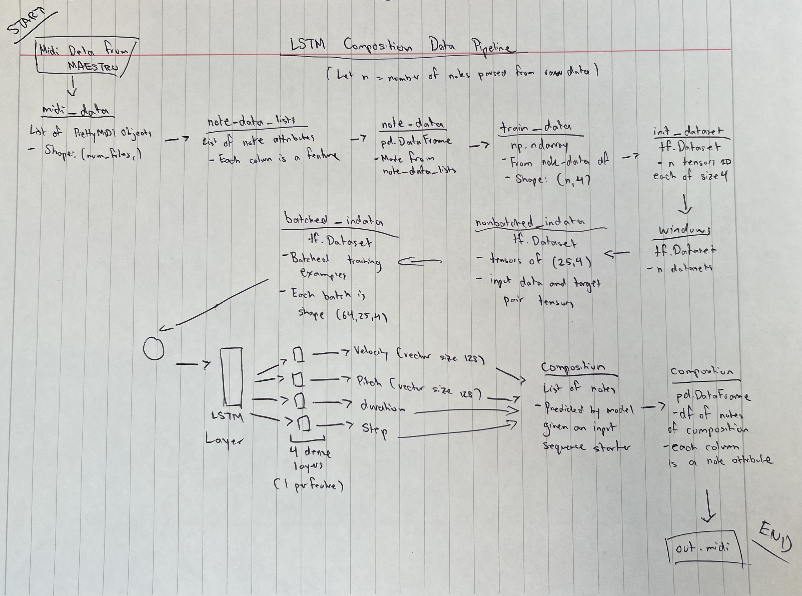

# LSTM Composition Network 
### By: Ray Jia Zhang 

### Description
---
A recurrent neural network (RNN) built on the Keras framework using the Functional API which utilizes Long Short Term Memory (LSTM) units to compose a short piece of MIDI music given some starter input. 
  
Training data was sourced from the MAESTRO dataset, specifically a series of Preludes and Fugues by Johann Sebastian Bach. 
  
The program uses the pretty_midi package to process MIDI data into trainable data. Data pipelining and processing is handled with Tensorflow, Numpy and Pandas. Matplotlib is used to plot total loss as a function of epochs after training. 
  
The jupyter_notebooks directory holds the starting point and main working files of this project. While the final implemented approach in Python contained in src is drawn from note_extract.ipynb, piano_roll_approach.ipynb demonstrates an initial naive approach. This approach utilized the piano rolls of the midi files as a one-hot vectorization of the music. Low training accuracy and overall performance eventually rendered this approach obsolete.
  
A basic data flow diagram is drawn below to demonstrate the transformations of data across the program. For the diagram:
- n = number of notes parsed from raw MIDI data 
- sequence_length = 25
- batch_size = 64
- num_features = 4
- Velocity and pitch range is [0,127]

### Result Interpretation
---
While the outputs admittedly cannot be considered "good sounding" by any means, there are some clear features that were learned. The key of the outputs is generally consistent with the inputs, and certain dynamic patterns are consistent with the input. 

### Future Work/Extensions
---
Future work would include training on different genres of music, further tuning hyperparameters and increasing depth of neural network. More features and designing custom loss functions would also greatly improve performance. 
